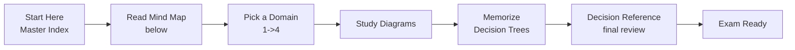
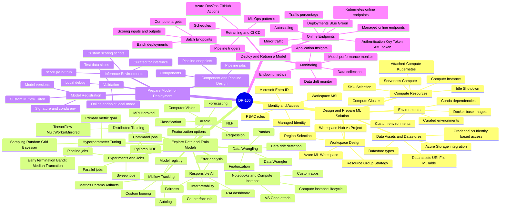
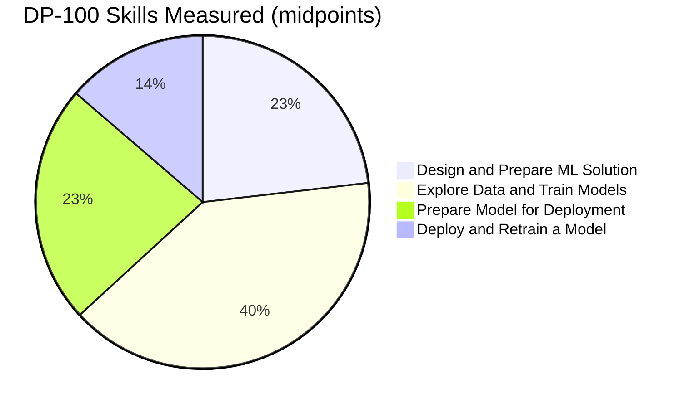
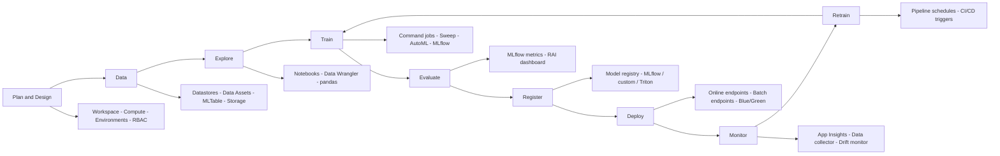
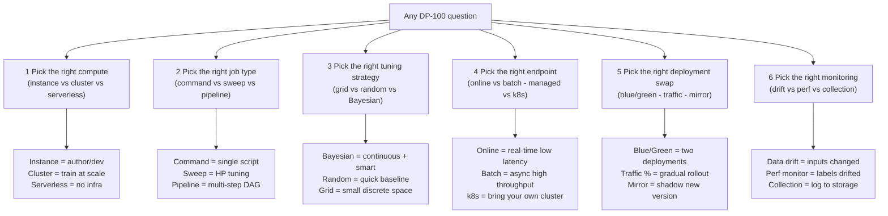
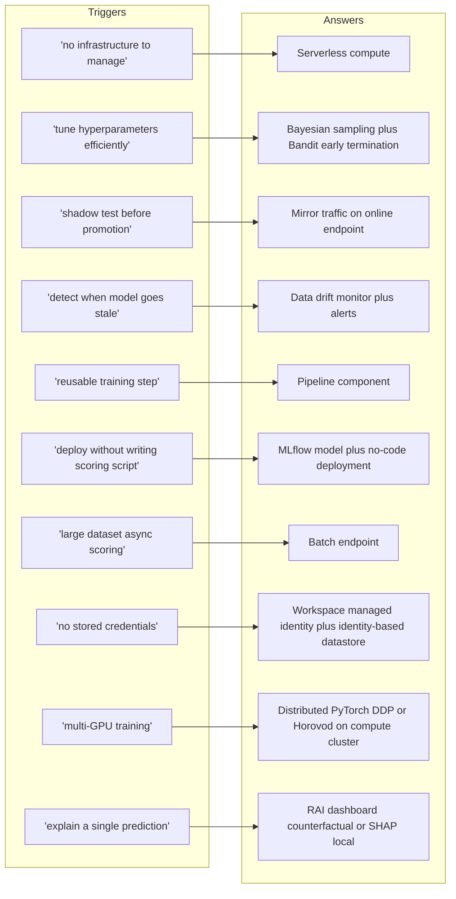

# DP-100 Visual Study Guide - Master Index

> **Designing and Implementing a Data Science Solution on Azure**
> Concept-only study aid built from the official Microsoft Learn skills measured. Diagrams, decision trees, and original summaries - no exam questions reproduced.

**Skills outline:** https://learn.microsoft.com/credentials/certifications/resources/study-guides/dp-100

---

## How to use this guide

---

## The 4 Exam Domains - Mind Map

---

## Official Skills Weighting

| Slice | Weight | Jump to chapter |
| --- | --- | --- |
| Design and Prepare ML Solution | **20-25%** | [01](01-design-and-prepare-ml-solution.md) |
| Explore Data and Train Models | **35-40%** | [02](02-explore-data-and-train-models.md) |
| Prepare Model for Deployment | **20-25%** | [03](03-prepare-model-for-deployment.md) |
| Deploy and Retrain a Model | **10-15%** | [04](04-deploy-and-retrain-model.md) |

> **Explore Data & Train Models is ~38% of the exam.** Spend 40% of your study time on AutoML, hyperparameter tuning, MLflow, and distributed training.

---

## ML lifecycle - service emphasis map

---

## The 6 Core Question Patterns in DP-100

---

## The "Magic Words" Translator

---

## Domain files in this guide

| # | Domain | File | Focus |
|---|--------|------|-------|
| 1 | Design & Prepare ML Solution | [01-design-and-prepare-ml-solution.md](01-design-and-prepare-ml-solution.md) | Workspace, compute, datastores, environments, RBAC |
| 2 | Explore Data & Train Models | [02-explore-data-and-train-models.md](02-explore-data-and-train-models.md) | Jobs, MLflow, AutoML, hyperdrive, distributed, RAI |
| 3 | Prepare Model for Deployment | [03-prepare-model-for-deployment.md](03-prepare-model-for-deployment.md) | Model registry, scoring scripts, components, validation |
| 4 | Deploy & Retrain a Model | [04-deploy-and-retrain-model.md](04-deploy-and-retrain-model.md) | Online + batch endpoints, monitoring, retraining |
| | **Exam Decision Reference** | [05-exam-cheatsheet.md](05-exam-cheatsheet.md) | Decision trees + scenario keyword map |
| | **Concept & Reference Index** | [06-references.md](06-references.md) | Every concept linked to Microsoft Learn |
| + | **Extra Concepts** | [07-extra-dp100-concepts.md](07-extra-dp100-concepts.md) | Edge cases + ML engineering philosophy |
| + | **Microsoft Learn Summaries** | [08-learn-summaries.md](08-learn-summaries.md) | Per-service overviews |
| + | **Architectures - DP-100** | [09-arch-dp100.md](09-arch-dp100.md) | Reference Azure ML architectures |

---

## Recommended study order (13 days)

```mermaid
gantt
    title Suggested 13-day plan
    dateFormat X
    axisFormat Day %d
    section Foundations
    Design and Prepare workspace :a1, 0, 3d
    section Training
    Data plus jobs plus MLflow :b1, after a1, 2d
    AutoML plus Hyperdrive :b2, after b1, 2d
    Distributed plus RAI :b3, after b2, 1d
    section Deployment
    Prepare for deployment :c1, after b3, 3d
    Deploy plus monitor plus retrain :c2, after c1, 2d
```

---

## Quick links

- [Exam Cheatsheet](05-exam-cheatsheet.md)
- [Concept & Reference Index](06-references.md)
- [Architectures](09-arch-dp100.md)
- [Glossary](12-glossary.md)
- [Flashcards](13-flashcards.md)
- [Pitfalls](14-pitfalls.md)
- [Hands-On Labs](15-hands-on-labs.md)
- [AI Copilot Quiz](17-copilot-quiz.md)
- [Practice Assessment](99-practice-assessment.md)
