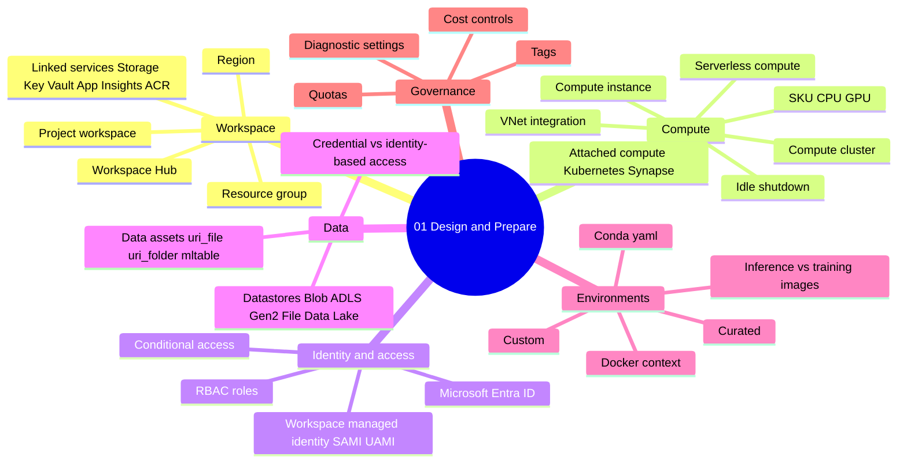
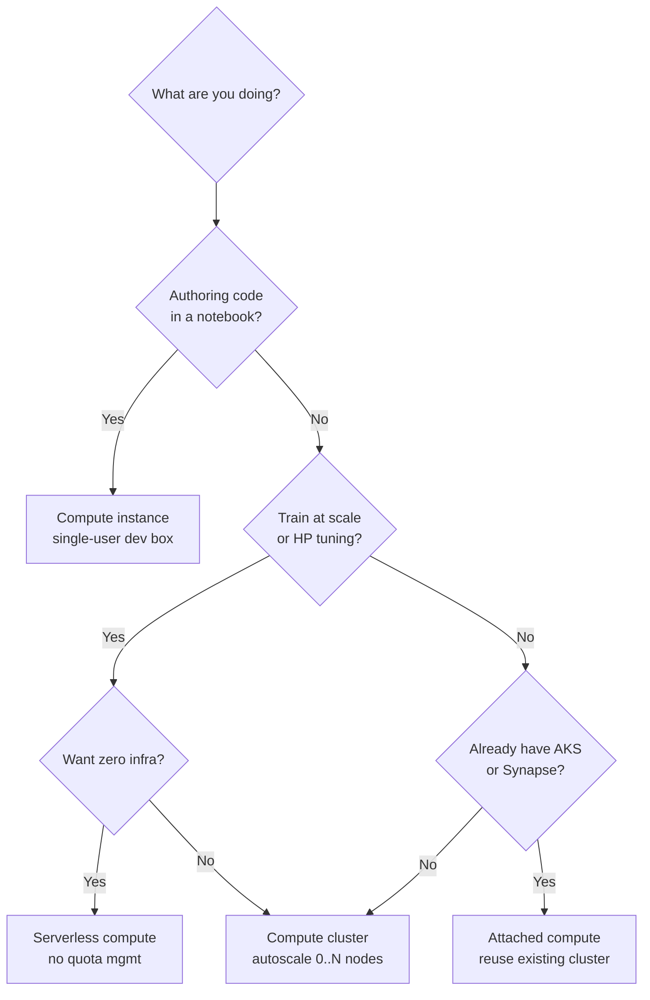
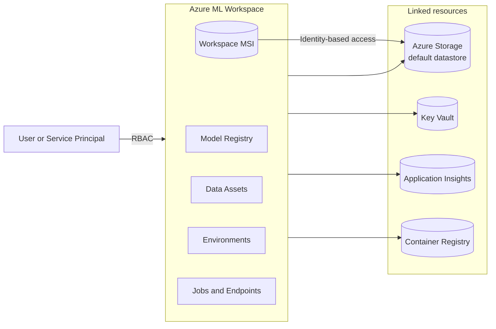
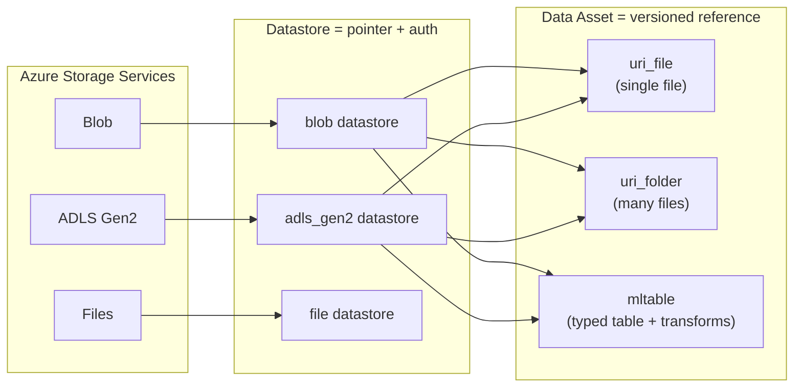
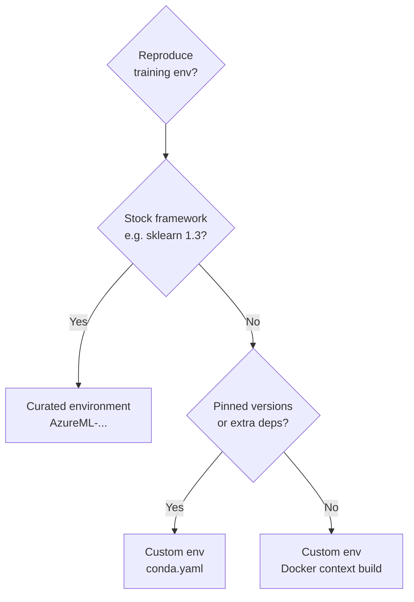
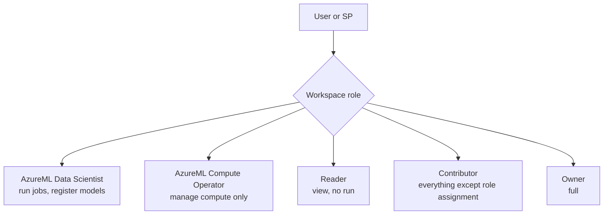
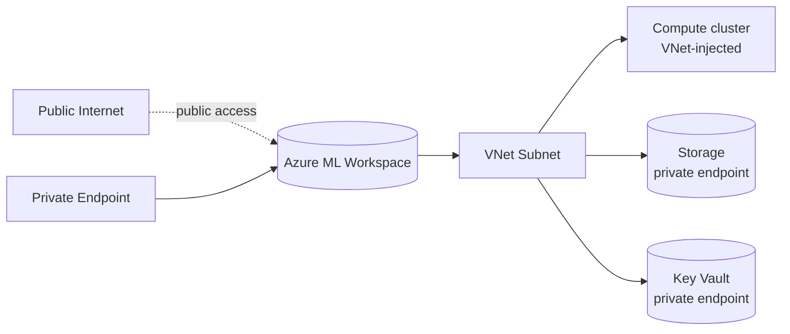

# Domain 1 - Design and Prepare an ML Solution

> **Weight: 20-25%** - Foundation domain. You design the workspace, pick compute, set up datastores and environments, and configure identity. Get this right or every later domain becomes painful.

---

## Mind map

---

## Compute decision tree

| Compute | Use when | Min nodes | Idle behavior |
|---|---|---|---|
| **Compute instance** | Author / debug / VS Code remote | always-on (1 VM) | manual stop or scheduled idle shutdown |
| **Compute cluster** | Repeatable training, sweep, pipeline | scales to 0 | scales to 0 after `idle_seconds_before_scaledown` |
| **Serverless compute** | Quick jobs, no quota planning | n/a | autoscales transparently |
| **Attached Kubernetes (AKS Arc)** | Bring your own cluster, GPU pools you already paid for | n/a | you manage |

> **Exam trap:** A compute instance does **not** scale to 0 - leaving it running is the #1 cost surprise. Use scheduled idle shutdown.

---

## Workspace topology

- **Workspace MSI** is the workspace's own identity. Grant it `Storage Blob Data Contributor` on the storage account if you want jobs to use identity-based access (no SAS, no keys).
- The **default datastore** (`workspaceblobstore`) is created automatically - backed by the storage account you selected at workspace creation.

---

## Datastores and data assets

- **`uri_file`** - point to one CSV/parquet/etc. Used by simple command jobs.
- **`uri_folder`** - point to a folder. Used when training scripts iterate files.
- **`mltable`** - schema + load transformations described in `MLTable` YAML. Required by AutoML tabular tasks.

| Auth mode | When to pick | Trade-off |
|---|---|---|
| **Credential-based** (account key / SAS) | Quick start, sandbox | Secrets stored in workspace Key Vault - rotation pain |
| **Identity-based** (workspace MSI / user identity) | Production | Need RBAC on the storage account, cleaner audit |

---

## Environments

- **Curated** envs = Microsoft-maintained, signed, published to ACR. Fastest startup. Names start with `AzureML-`.
- **Custom** envs = your conda spec or Dockerfile. Built once, cached in the workspace ACR.
- Always **pin** versions for reproducibility. `azureml-mlflow` and `mlflow` should match.

---

## Identity and RBAC

> **Least privilege rule:** Data Scientist role + storage RBAC is enough for 90% of users. Avoid Owner outside platform team.

---

## Networking quick view

For a fully private workspace: private endpoints on workspace + storage + Key Vault + ACR + App Insights, VNet-injected compute, and `public_network_access_enabled = false`.

---

## Common pitfalls

- **Compute instance left running** overnight - use idle shutdown.
- **Curated environment doesn't match your pinned package** - switch to a custom env.
- **Identity-based datastore but no RBAC** - workspace MSI needs `Storage Blob Data Contributor`.
- **Wrong region** for GPU SKUs - check quota + availability before workspace create.
- **Region mismatch** between workspace and storage causes egress cost + latency.
- **AutoML expects MLTable** - `uri_folder` will fail with cryptic errors.

---

## Microsoft Learn

- [What is an Azure Machine Learning workspace?](https://learn.microsoft.com/azure/machine-learning/concept-workspace)
- [Azure ML compute targets](https://learn.microsoft.com/azure/machine-learning/concept-compute-target)
- [Manage data assets](https://learn.microsoft.com/azure/machine-learning/how-to-create-data-assets)
- [Azure ML environments](https://learn.microsoft.com/azure/machine-learning/concept-environments)
- [Built-in roles for Azure ML](https://learn.microsoft.com/azure/machine-learning/how-to-assign-roles)

---

[<- Master Index](00-MASTER-INDEX.md) - [Explore Data and Train Models ->](02-explore-data-and-train-models.md)
