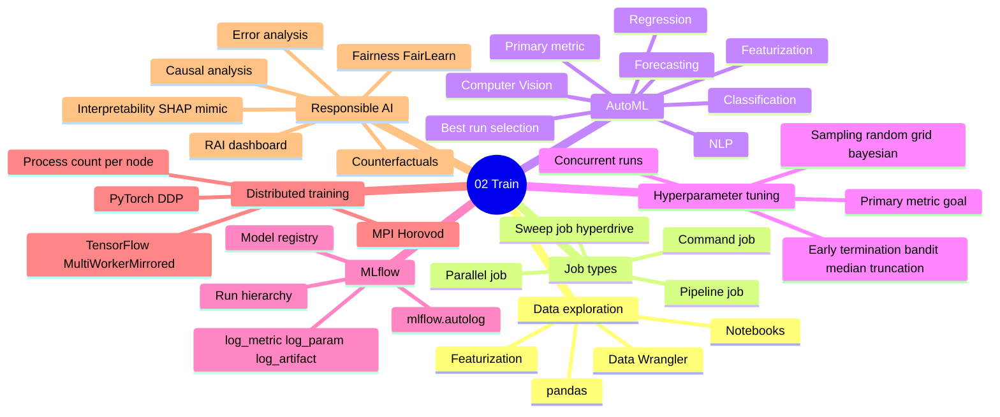
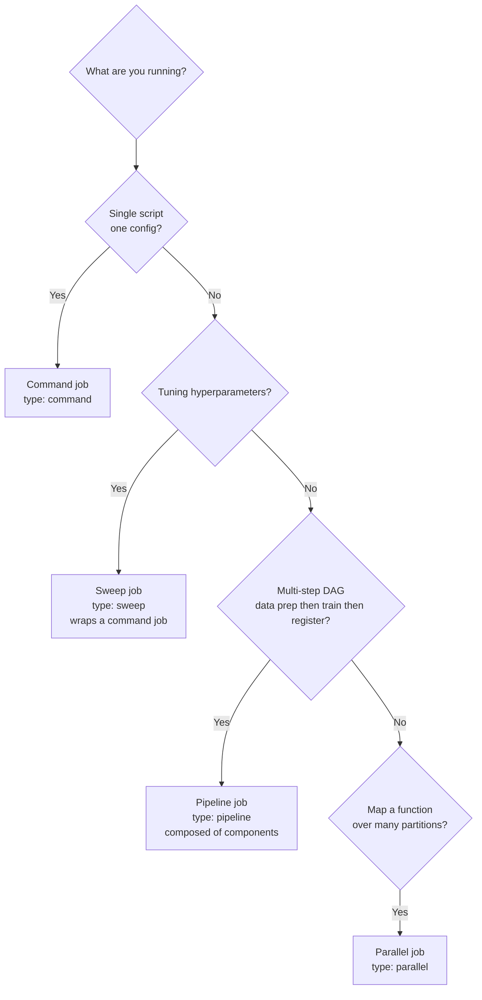
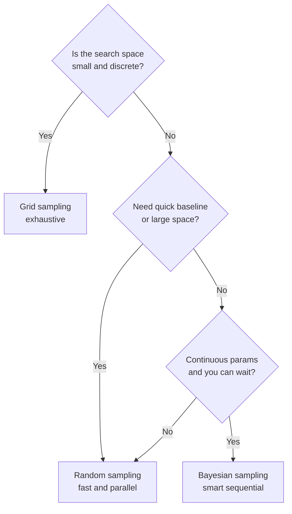
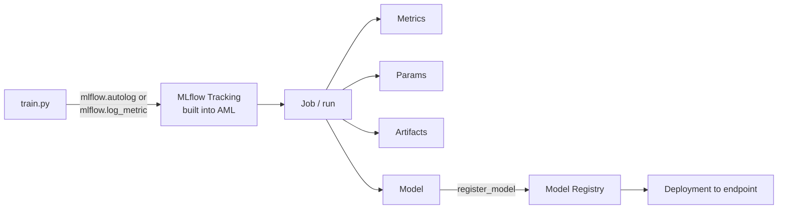
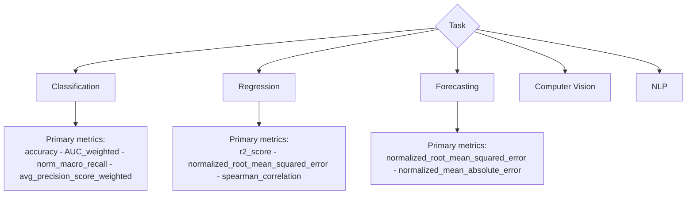
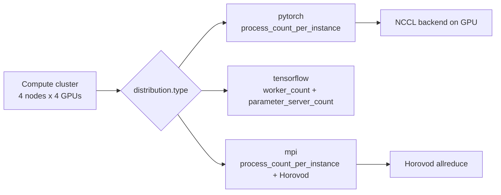
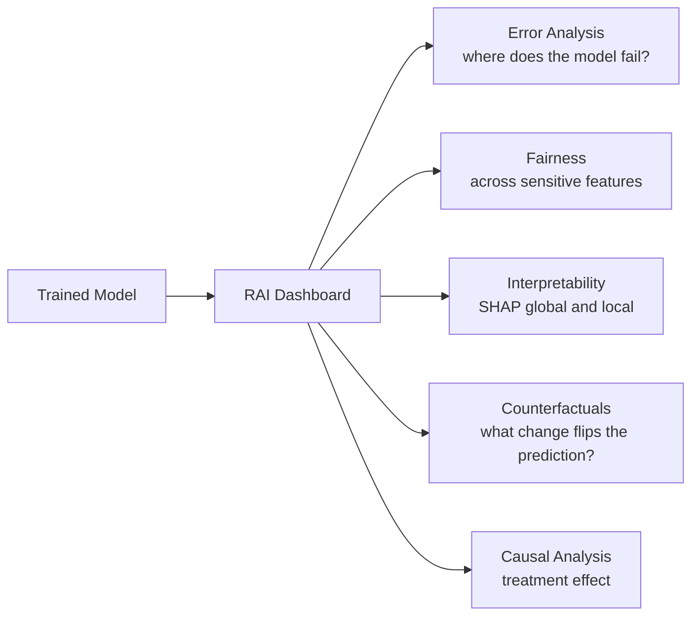
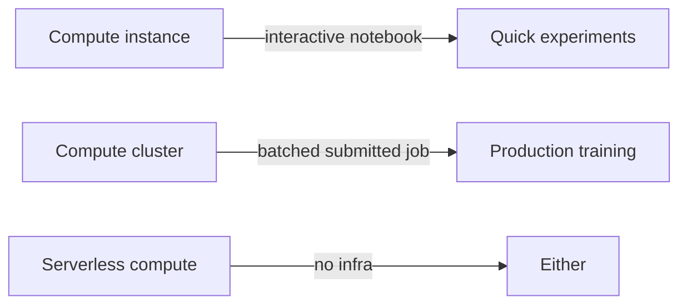

# Domain 2 - Explore Data and Train Models

> **Weight: 35-40%** - The biggest domain. Jobs, MLflow tracking, AutoML, hyperparameter tuning, distributed training, and Responsible AI. Master this.

---

## Mind map

---

## Job decision tree

| Job | YAML `type` | Inputs | Use case |
|---|---|---|---|
| Command | `command` | one script + args | "train.py with these params" |
| Sweep | `sweep` | command job + search space + sampler + termination | hyperparameter tuning |
| Pipeline | `pipeline` | components stitched via outputs->inputs | multi-stage workflow |
| Parallel | `parallel` | partitioned data + entry script | embarrassingly parallel inference / featurization |

---

## Hyperparameter sweep - pick the strategy

**Sampling rules:**

- **Grid** - `choice()` only. Fully enumerates. Use when you have <= ~50 combos.
- **Random** - works with `choice`, `uniform`, `loguniform`, `normal`, etc. Best general-purpose default.
- **Bayesian** - picks each next config based on past results. **Cannot use early termination policies.** Continuous distributions only (`uniform`, `quniform`, `choice`).

**Early termination policies** (kill bad runs early - saves cost):

| Policy | Decision rule | Picks |
|---|---|---|
| **Bandit** | Kill if metric within `slack_factor` of best | Aggressive - quick saver |
| **Median Stopping** | Kill if running average worse than median of completed runs at same interval | Conservative |
| **Truncation Selection** | Kill bottom `truncation_percentage` at each evaluation interval | Predictable cull |
| **No policy** | All runs complete | Bayesian only |

---

## MLflow flow

- **`mlflow.autolog()`** - captures sklearn / pytorch / xgboost / tensorflow params + metrics + model **automatically**. First call you should make.
- An **MLflow model** has `MLmodel` + `conda.yaml` + `model.pkl` (or framework files). Required for **no-code deployment** to online endpoint.
- Azure ML's tracking URI is set automatically inside a job; outside a job, use `azureml.mlflow` to get the URI from the workspace.

---

## AutoML decision matrix

- **Featurization** modes: `auto` (default), `off`, `custom` (provide a `featurization_config`).
- **Forecasting** needs `time_column_name` and optionally `time_series_id_column_names` for multi-series.
- **Cross-validation**: set `n_cross_validations` (or use a validation dataset).
- **Best run** is auto-selected by primary metric; child runs are tracked in MLflow.

---

## Distributed training

- **PyTorch DDP** - `distribution: type: pytorch` and set `process_count_per_instance` to GPUs per node.
- **TensorFlow** - `MultiWorkerMirroredStrategy` typically.
- **Horovod** - runs as MPI; works with TF, PyTorch, MXNet.
- Cluster needs an **InfiniBand-enabled SKU** (`NDv2`, `ND_A100_v4`) for efficient multi-GPU.

---

## Responsible AI dashboard

- Build with the **`Responsible AI Insights` component** in a pipeline, then add specific tool components (Error Analysis, Counterfactual, Causal, Explanation).
- The dashboard renders inside the studio under the registered model's "Responsible AI" tab.

---

## Compute instance vs cluster - when training

- A compute instance can run jobs for prototyping but doesn't autoscale. For sweep / pipeline / parallel jobs you want a cluster or serverless.

---

## Common pitfalls

- **Bayesian sampling + early termination** = invalid. Bayesian must run to completion.
- **Grid + continuous distribution** = invalid. Grid requires `choice()` only.
- **AutoML forecasting without time column** = error.
- **Forgot to set primary metric goal** (`maximize` vs `minimize`) - sweep picks wrong best run.
- **Autolog logs nothing** because the framework version isn't supported - pin compatible versions.
- **Distributed PyTorch but `process_count_per_instance = 1`** - you're running one process; no gradient sync.
- **Compute cluster has min nodes > 0** - costs money 24/7. Default to `min_instances=0`.
- **Concurrent runs > cluster max_instances** - runs queue, sweep slows down.

---

## Microsoft Learn

- [Train models with Azure Machine Learning](https://learn.microsoft.com/azure/machine-learning/concept-train-machine-learning-model)
- [Hyperparameter tuning a model](https://learn.microsoft.com/azure/machine-learning/how-to-tune-hyperparameters)
- [What is automated ML?](https://learn.microsoft.com/azure/machine-learning/concept-automated-ml)
- [Track ML experiments and models with MLflow](https://learn.microsoft.com/azure/machine-learning/how-to-use-mlflow-cli-runs)
- [Distributed GPU training guide](https://learn.microsoft.com/azure/machine-learning/how-to-train-distributed-gpu)
- [Responsible AI dashboard](https://learn.microsoft.com/azure/machine-learning/concept-responsible-ai-dashboard)

---

[<- Design and Prepare ML Solution](01-design-and-prepare-ml-solution.md) - [Prepare Model for Deployment ->](03-prepare-model-for-deployment.md)
