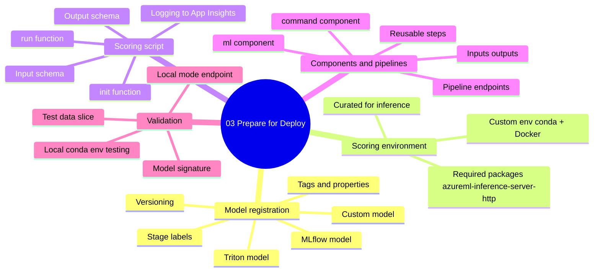
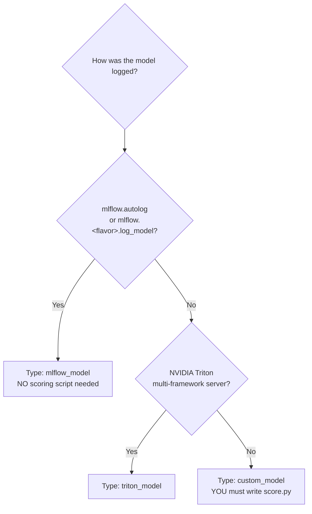
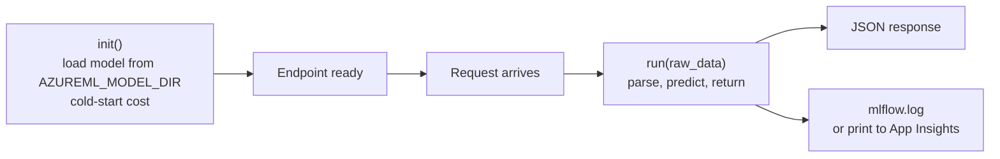
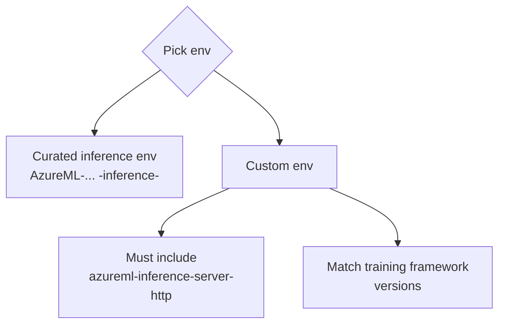
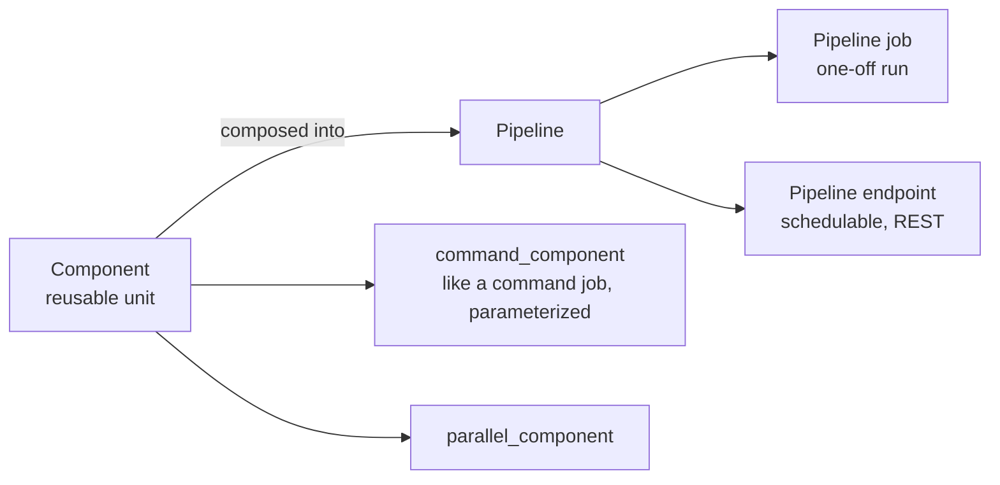
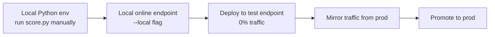

# Domain 3 - Prepare a Model for Deployment

> **Weight: 20-25%** - You take a trained model, register it correctly, package an inference environment, write a scoring script (or skip it with MLflow), and validate before shipping.

---

## Mind map



---

## Model types decision tree



| Model type | Scoring script required? | Auto endpoint? | Use when |
|---|---|---|---|
| `mlflow_model` | **No** | Yes - no-code deploy | sklearn / pytorch / xgboost / tf / spark logged via MLflow |
| `custom_model` | **Yes** - `score.py` | No | Anything else, or you need custom preprocessing |
| `triton_model` | No (Triton server) | Yes | High-performance multi-framework serving |

---

## Scoring script anatomy



```python
# score.py
import os, json, joblib

def init():
    global model
    model_path = os.path.join(os.environ["AZUREML_MODEL_DIR"], "model.pkl")
    model = joblib.load(model_path)

def run(raw_data):
    data = json.loads(raw_data)["data"]
    preds = model.predict(data).tolist()
    return {"predictions": preds}
```

- **`AZUREML_MODEL_DIR`** is the env var the runtime sets - it points to your registered model files.
- `init()` runs **once** per replica at startup. `run()` runs **per request**.
- Heavy work (download/load) belongs in `init()`. Anything in `run()` adds to per-request latency.

---

## Inference environment



- **Curated inference environments** ship with the **inference server** pre-installed and pinned framework versions. Fastest path.
- **Custom envs** for inference need `azureml-inference-server-http` (the HTTP frontend that calls your `run()`).
- Build once, reuse across deployments. The image is cached in workspace ACR.

---

## Components and pipelines



| Concept | What it is |
|---|---|
| **Component** | YAML or `@command_component` Python decorator. Defines `inputs`, `outputs`, `code`, `command`, `environment`. |
| **Pipeline job** | DAG of components. Outputs of one feed inputs of another. Submitted as `type: pipeline` job. |
| **Pipeline endpoint** | Published pipeline, callable via REST. Versioned. Used for scheduled retraining. |

---

## Validation before deployment



- **Local online endpoints** (`az ml online-endpoint create --local`) run the same Docker image on your dev machine. Catches `init()` errors fast.
- **Mirror traffic** (next domain) lets you shadow-test new versions with real production payloads at no user-visible cost.

---

## Model signature & input schema

- **MLflow signature** - declares input/output schema. Lets the studio UI build a test form and lets endpoints validate inputs.
- For **custom models**, define the JSON contract yourself. Common pattern: `{"input_data": {"columns": [...], "data": [[...]]}}`.

---

## Common pitfalls

- **Logged with `mlflow.log_artifact("model.pkl")`** - that's an artifact, **not** a registered model. No no-code deploy. Use `mlflow.<flavor>.log_model(...)`.
- **`init()` failure** - endpoint deployment goes Unhealthy. Check `Deployment logs` in studio.
- **Forgot `azureml-inference-server-http`** in custom env - the HTTP server fails to start.
- **`AZUREML_MODEL_DIR` hard-coded path** - works locally, breaks in endpoint. Always use the env var.
- **Component `code` path too large** - slow uploads. Add `.amlignore` for unrelated files.
- **Pipeline reuses cache unintentionally** - set `is_deterministic = false` for steps that depend on time/external data.
- **Triton model layout wrong** - Triton requires `model_repository/<model_name>/<version>/...` directory structure.

---

## Microsoft Learn

- [Manage models in Azure ML](https://learn.microsoft.com/azure/machine-learning/how-to-manage-models)
- [Deploy MLflow models to online endpoints](https://learn.microsoft.com/azure/machine-learning/how-to-deploy-mlflow-models-online-endpoints)
- [Author scoring scripts for online endpoints](https://learn.microsoft.com/azure/machine-learning/how-to-deploy-online-endpoints#define-the-deployment)
- [Create and run ML pipelines](https://learn.microsoft.com/azure/machine-learning/how-to-create-component-pipeline-python)

---

[<- Explore Data and Train Models](02-explore-data-and-train-models.md) - [Deploy and Retrain a Model ->](04-deploy-and-retrain-model.md)
