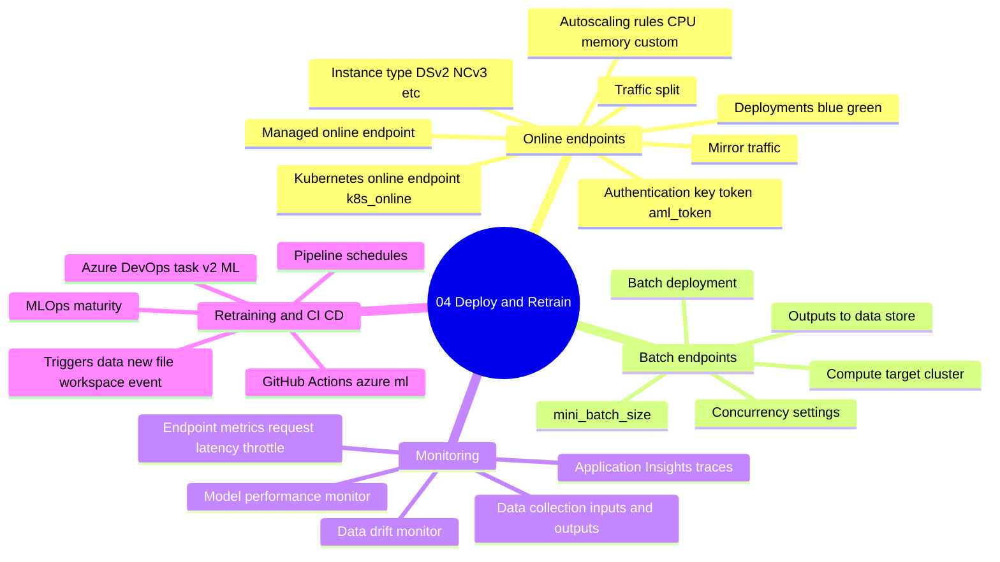
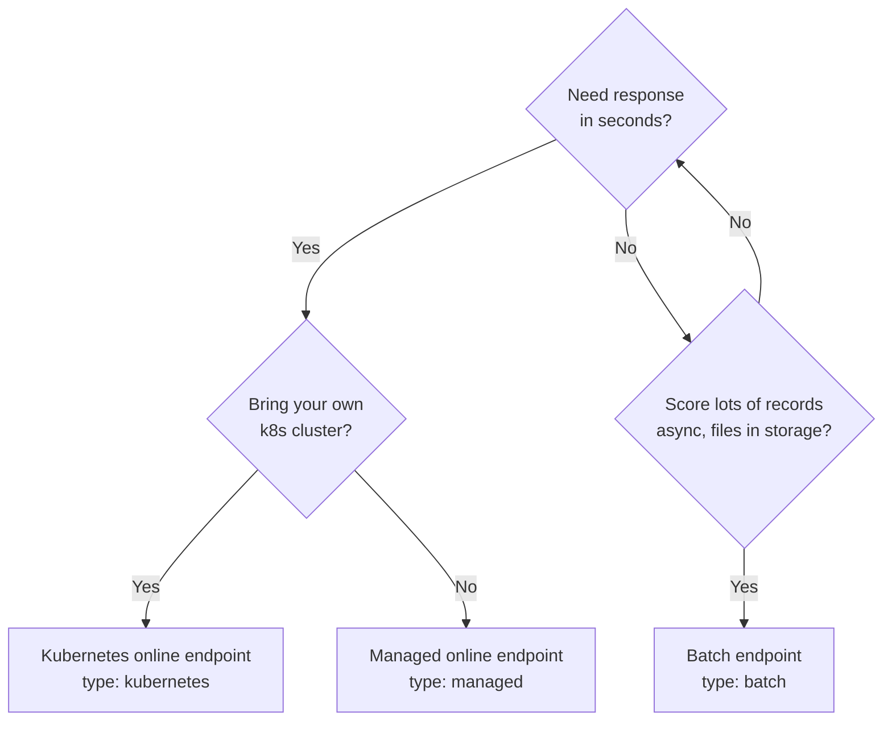
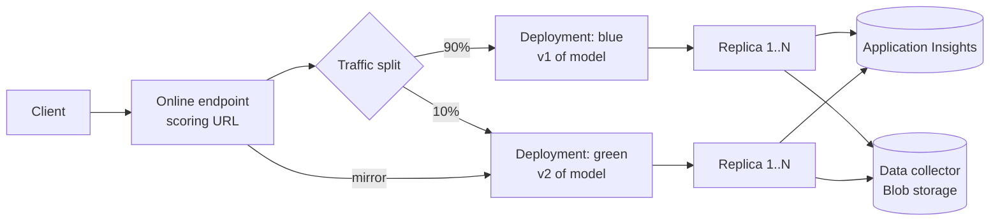
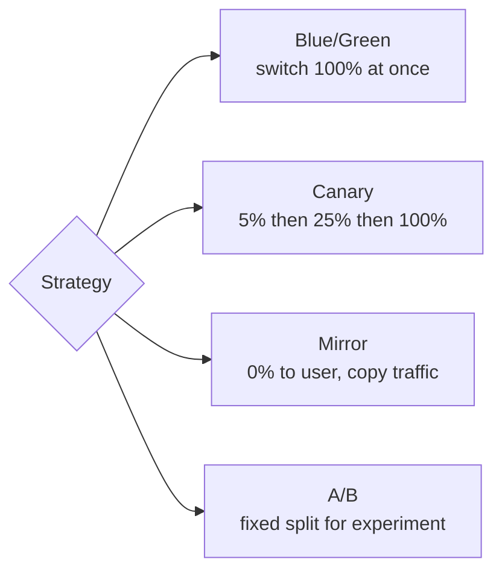
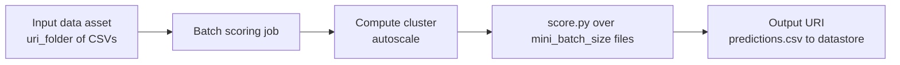
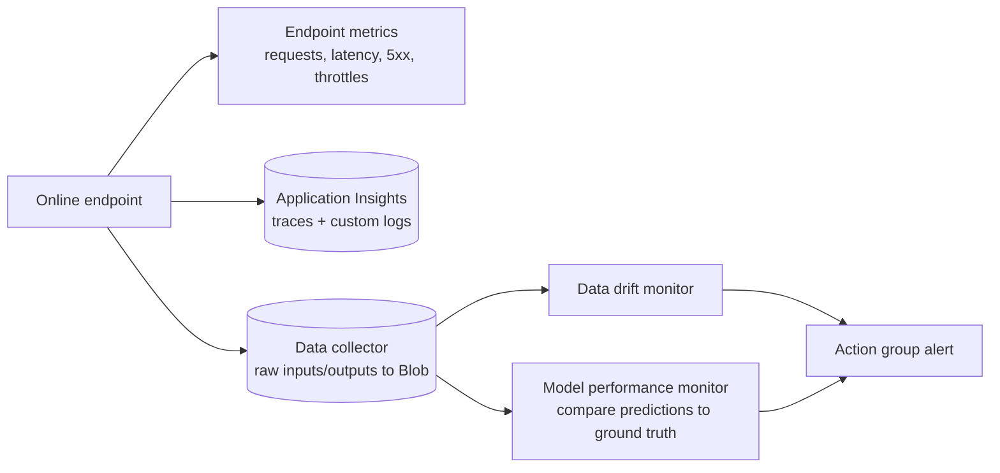
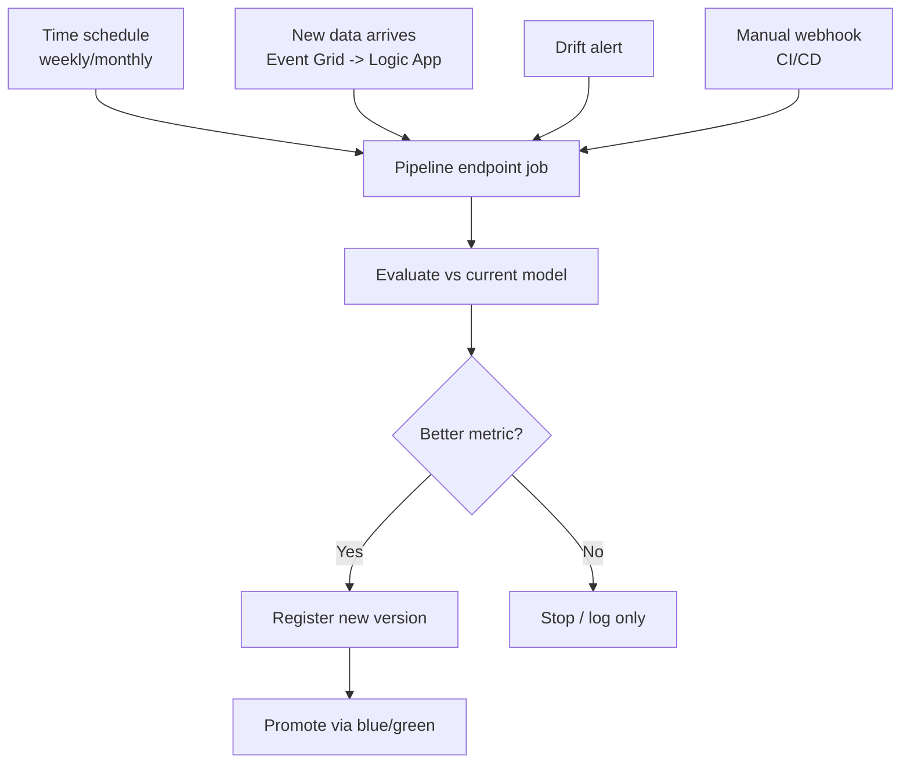
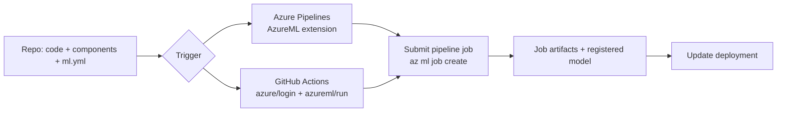

# Domain 4 - Deploy and Retrain a Model

> **Weight: 10-15%** - Smaller domain but heavy on decisions: which endpoint, which deployment strategy, how to monitor, when to retrain. Online endpoints rotate hard on the exam.

---

## Mind map

---

## Endpoint decision tree

| Endpoint | Latency | Throughput | Compute | Auth |
|---|---|---|---|---|
| **Managed online** | ms | medium | Microsoft-managed VMs | key, AML token, Microsoft Entra token |
| **Kubernetes online** | ms | high (you scale) | your AKS / Arc cluster | same |
| **Batch** | minutes-hours | huge | your compute cluster / serverless | key, AML token, Microsoft Entra token |

---

## Online deployment topology

- **Endpoint** has a stable URL. **Deployments** sit under it (default names blue/green).
- Promote new version: deploy `green` at 0% -> mirror prod traffic -> flip traffic to `green` -> delete `blue`.
- **Mirror traffic** = duplicates the request to a deployment without sending the response back. Pure shadow test.

---

## Deployment swap patterns

| Pattern | Implement with | Rollback |
|---|---|---|
| Blue/Green | `traffic = {blue: 100}` -> `{green: 100}` | flip back |
| Canary | gradual `{blue: 95, green: 5}` -> `{50, 50}` -> `{0, 100}` | flip back |
| Mirror | `mirror_traffic = {green: 100}` | no user impact, no rollback needed |
| A/B | hold split (e.g. `{blue: 50, green: 50}`) over time | analyze metrics, then flip |

---

## Batch endpoint flow

- **`mini_batch_size`** = files per task invocation. Tune for memory.
- **`max_concurrency_per_instance`** = parallel task processes per VM.
- **`error_threshold`** = how many record-level failures to allow before failing the job.
- For MLflow models: **no `score.py`** needed. Just supply the model and input data shape.

---

## Authentication options

| Auth mode | Token lives in | Rotates? | Best for |
|---|---|---|---|
| **Key** | endpoint resource | manual rotation | quick demos |
| **AML token** | endpoint, scoped | TTL ~1h | service-to-service |
| **Microsoft Entra token** (`aad_token`) | caller's identity | per-call | production with managed identity |

> Production rule: **Microsoft Entra token + managed identity caller** > AML token > key.

---

## Monitoring landscape

- **Endpoint metrics** are platform metrics (Azure Monitor) - no extra setup.
- **Data collector** opt-in per deployment; logs payloads to Blob with timestamps. Required to feed drift / perf monitors.
- **Data drift monitor** compares production input distribution to a baseline (training set). Triggers when a feature shifts beyond a threshold.
- **Model performance monitor** needs **ground-truth labels** joined to predictions - typically via a delayed pipeline.

---

## Retraining triggers

- Schedules can be `cron` or `recurrence` style on the pipeline endpoint.
- Always **evaluate before promoting** - a retrained model can be worse on the holdout.

---

## CI/CD integration

- Use **OIDC / workload identity federation** instead of stored secrets in both Azure DevOps and GitHub Actions.
- Workspace MSI on the storage account = no SAS, no keys.

---

## Common pitfalls

- **Endpoint stuck in `Updating`** - usually a `init()` exception. Check deployment logs.
- **Traffic split totals != 100** - endpoint update fails.
- **Mirror traffic > 50%** - not allowed; cap is 50%.
- **Forgot to enable data collection** - no inputs available for drift monitor.
- **Batch job OOM** - mini_batch_size too large for instance memory.
- **Drift monitor trained on tiny baseline** - flaps on noise. Use representative size.
- **Online endpoint with public access in private workspace** - set `public_network_access` on the endpoint.
- **Schedule TZ** - defaults to UTC; if you want local, set `time_zone` explicitly.
- **No autoscale rules** - fixed instance count = either over- or under-provisioned.

---

## Microsoft Learn

- [Online endpoints overview](https://learn.microsoft.com/azure/machine-learning/concept-endpoints-online)
- [Batch endpoints overview](https://learn.microsoft.com/azure/machine-learning/concept-endpoints-batch)
- [Safe rollout for online endpoints](https://learn.microsoft.com/azure/machine-learning/how-to-safely-rollout-online-endpoints)
- [Collect production data from models](https://learn.microsoft.com/azure/machine-learning/how-to-collect-production-data)
- [Model monitoring](https://learn.microsoft.com/azure/machine-learning/how-to-monitor-model-performance)
- [Schedule machine learning pipeline jobs](https://learn.microsoft.com/azure/machine-learning/how-to-schedule-pipeline-job)
- [MLOps with Azure ML](https://learn.microsoft.com/azure/machine-learning/concept-model-management-and-deployment)

---

[<- Prepare Model for Deployment](03-prepare-model-for-deployment.md) - [Master Index](00-MASTER-INDEX.md)
