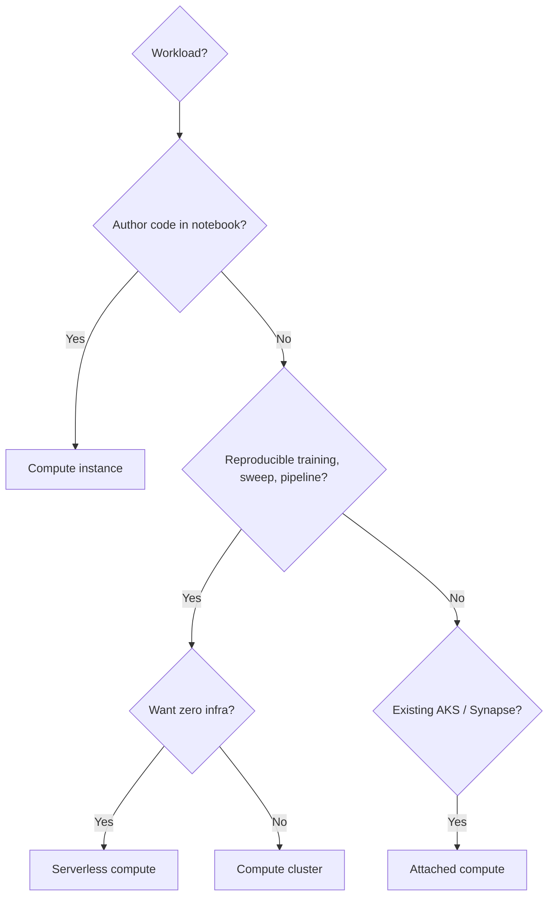
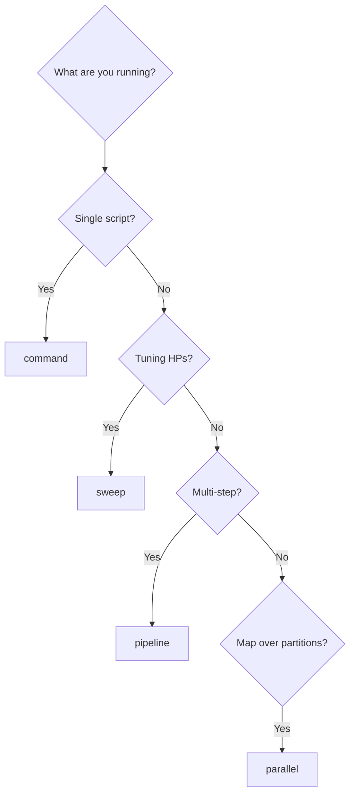
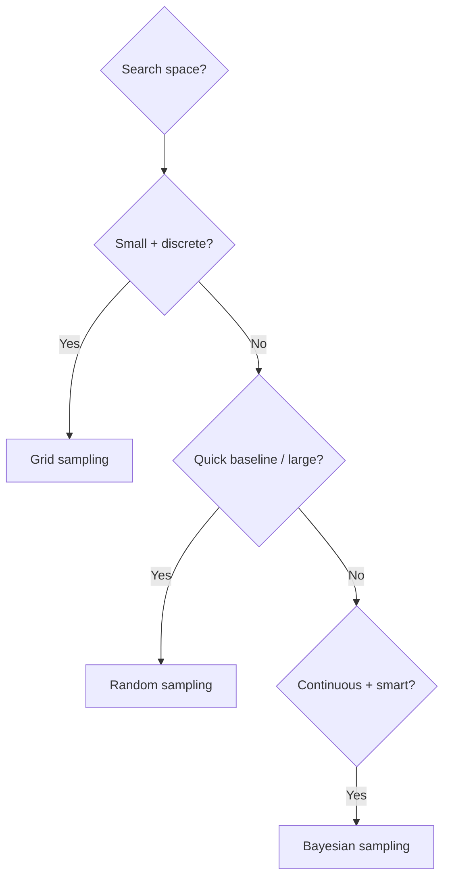
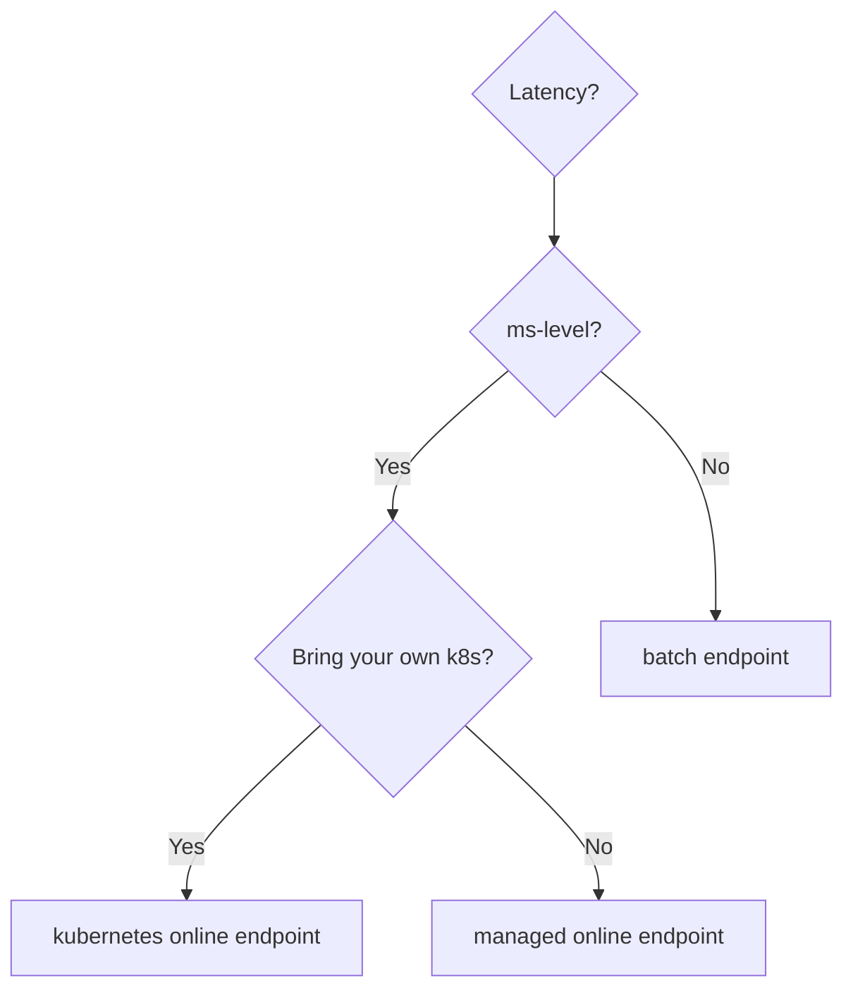

# DP-100 Exam Decision Reference (Cheatsheet)

> One-page final review. If you can answer every "When you see..." in this page, you are exam-ready.

---

## Pick the right compute

---

## Pick the right job type

---

## Pick the right sampling strategy

> Bayesian + early termination = **invalid**. Bayesian + continuous distribution only.

---

## Pick the right early termination

| If you want... | Pick... |
|---|---|
| Aggressive cost savings | **Bandit** |
| Conservative culling | **Median Stopping** |
| Predictable budget | **Truncation Selection** |
| Bayesian sampling | **No policy** |

---

## Pick the right endpoint

---

## Pick the right rollout pattern

| When you want... | Pattern | Implementation |
|---|---|---|
| Instant cutover with rollback | Blue/Green | swap `traffic` 0->100 |
| Gradual exposure | Canary | step `traffic` 5->25->100 |
| Shadow test, no user impact | **Mirror** | set `mirror_traffic = {green: 100}` |
| Fixed experiment split | A/B | hold `traffic = {blue: 50, green: 50}` |

---

## Pick the right model logging

| Goal | API |
|---|---|
| No-code deployment to online endpoint | **`mlflow.<flavor>.log_model(...)`** |
| Custom preprocessing in `score.py` | log custom model + register manually |
| Track training params + metrics auto | **`mlflow.autolog()`** |
| Multi-framework GPU serving | Triton model |

---

## Pick the right monitoring

| Question | Tool |
|---|---|
| Are inputs drifting from training? | **Data drift monitor** |
| Are predictions worse vs ground truth? | **Model performance monitor** |
| Where are 5xx coming from? | **Endpoint metrics + Application Insights** |
| Save raw payloads for offline analysis | **Data collector -> Blob** |

---

## Magic-words -> answer map

| Trigger phrase | Answer |
|---|---|
| "no infrastructure to manage" | Serverless compute |
| "cost-optimal hyperparameter search on continuous params" | Bayesian sampling |
| "kill the worst runs early" | Bandit / Median / Truncation policy |
| "deploy without writing scoring script" | MLflow model on online endpoint |
| "shadow test new version" | Mirror traffic |
| "async score 10M records" | Batch endpoint |
| "no stored credentials" | Identity-based datastore + workspace MSI |
| "data scientist runs jobs but not Owner" | AzureML Data Scientist role |
| "AutoML on tabular data" | MLTable data asset |
| "explain a single prediction" | RAI dashboard counterfactual / local SHAP |
| "model degraded over time, retrain" | Schedule on pipeline endpoint + drift trigger |
| "embarrassingly parallel inference" | Parallel job |
| "multi-GPU training across nodes" | Distributed PyTorch / Horovod on InfiniBand cluster |
| "feature engineering shared across jobs" | Pipeline component |
| "private workspace, no public access" | Private endpoints + VNet-injected compute |

---

## Identity quick reference

| Identity | Best use |
|---|---|
| Workspace MSI (system-assigned) | Default - workspace <-> storage / Key Vault / ACR |
| User-assigned MI on workspace | Cross-resource sharing, lifecycle independent of workspace |
| Compute cluster identity | Per-job access to data |
| Online endpoint identity | Endpoint pulling secrets from Key Vault at runtime |

---

## Pricing & quota traps

- Compute instance does **not** scale to 0.
- GPU SKUs (NCv3, NDv2, ND_A100) have **regional quota** - request before workspace create.
- Curated environments are free; custom env image build uses ACR + cluster minutes.
- Online endpoints bill per replica-hour even when idle.

---

## Final 30-second mental checklist

1. **Right compute?** Instance vs cluster vs serverless.
2. **Right job?** command / sweep / pipeline / parallel.
3. **Right sampling + early termination combo?**
4. **MLflow autolog or manual?**
5. **Right endpoint type for latency?**
6. **Blue/green / mirror / canary?**
7. **Drift vs perf vs collection - what does the question ask?**
8. **Identity-based or credential-based data access?**

---

[<- Master Index](00-MASTER-INDEX.md)
