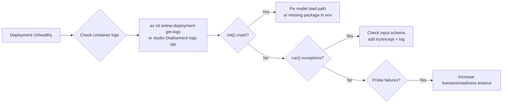
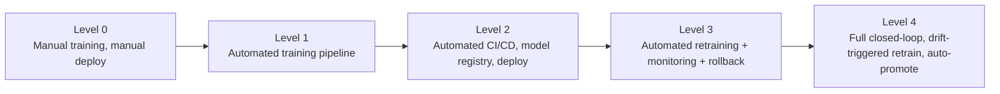

# Extra DP-100 Concepts

> Edge cases, philosophy, and "why" topics that don't fit neatly into one domain but show up on the exam.

---

## SDK v1 vs SDK v2 - exam reality

The exam is on **CLI v2 / SDK v2**. Forget `Workspace.from_config()`, `Experiment(...)`, `Estimator(...)`, `RunConfiguration(...)` - those are v1 idioms.

| v1 (legacy) | v2 (current) |
|---|---|
| `Workspace`, `Experiment`, `Run` | `MLClient`, `command()`, `sweep()`, `pipeline()` |
| `Datastore`, `Dataset` | `Datastore`, `Data` (data asset) |
| `Environment` (curated names different) | `Environment` with `image` / `conda_file` |
| `AKSCompute`, `AmlCompute` | `AmlCompute`, `KubernetesCompute` |
| `InferenceConfig` + `Model.deploy(...)` | `ManagedOnlineEndpoint` + `ManagedOnlineDeployment` |
| Pipelines via `PythonScriptStep` | Components + `@pipeline` |
| HyperDriveConfig | Sweep job (CLI YAML) / `command(...).sweep(...)` |

---

## CLI YAML vs Python SDK - they describe the same thing

```yaml
# job.yml - CLI v2
$schema: https://azuremlschemas.azureedge.net/latest/commandJob.schema.json
type: command
code: ./src
command: python train.py --lr ${{inputs.lr}}
inputs:
  lr: 0.01
environment: azureml:my-env@latest
compute: azureml:cpu-cluster
```

```python
# Python SDK v2 - equivalent
from azure.ai.ml import command, Input, MLClient
job = command(
    code="./src",
    command="python train.py --lr ${{inputs.lr}}",
    inputs={"lr": 0.01},
    environment="my-env@latest",
    compute="cpu-cluster",
)
ml_client.jobs.create_or_update(job)
```

Either is acceptable. CLI is friendlier for CI/CD.

---

## When to use serverless vs cluster

| Use serverless when... | Use cluster when... |
|---|---|
| One-off training run | Recurring jobs you want quota for |
| You don't want to plan SKUs | You need a specific InfiniBand SKU |
| Quick experiments | Hot caches matter (custom env reuse) |
| You can't get quota | You can guarantee throughput |

Serverless is **per-job** - no idle minutes, no quota planning, but slightly higher startup latency.

---

## Featurization in AutoML

- **`auto`** - default. Imputes missing, encodes categoricals, normalizes, drops high-cardinality / low-variance, generates time-based features.
- **`off`** - you give it pure numerics. Use when you've already engineered features in a pipeline upstream.
- **`custom`** - provide a `featurization_config` overriding column types, transformers, drop columns, transformer params.

Featurization choices are **logged** to MLflow as part of the AutoML parent run.

---

## Pipeline caching

Each pipeline step has `is_deterministic` (default `true`). When `true`, Azure ML hashes inputs + code + env and **reuses prior outputs** if a match exists.

Force a step to always run: `is_deterministic: false`. Useful for steps reading "today's data".

---

## Concurrency model in sweep


- `max_total_trials` - total HP combinations to try.
- `max_concurrent_trials` - parallelism. Capped by cluster `max_instances` and per-trial GPU/CPU count.
- Bayesian sampling **must be sequential by design**, but it relaxes the constraint with batch Bayesian - set concurrency thoughtfully.

---

## Online endpoint scaling

| Mode | What happens |
|---|---|
| Manual | Fixed `instance_count` |
| Autoscale (Azure Monitor rules) | Scale on CPU / mem / custom metric (RPS via App Insights) |

Scale takes **minutes**. For bursty workloads, set a higher minimum.

---

## Debugging an unhealthy deployment



Run **locally first** with `--local` to skip waiting on cluster scheduling.

---

## Cost optimization checklist

- Compute instance idle shutdown enabled.
- Compute cluster `min_instances=0`.
- Sweep uses early termination policy (Bandit / Median / Truncation).
- Online endpoint right-sized - autoscale rules in place.
- Curated env reused (no per-job custom builds).
- Storage in same region as workspace (no egress).
- Use **Spot / Low-priority VMs** on compute cluster for interruptible training.

---

## MLOps maturity ladder



The exam loosely maps to Levels 2-3.

---

[<- Master Index](00-MASTER-INDEX.md)
