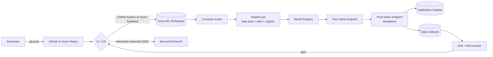
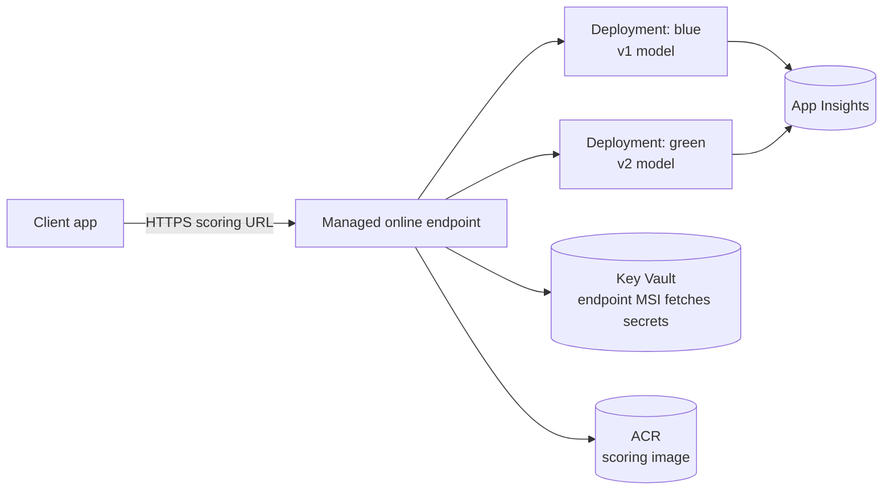
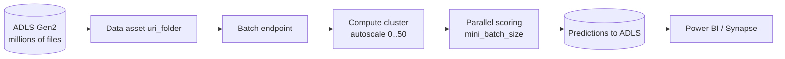
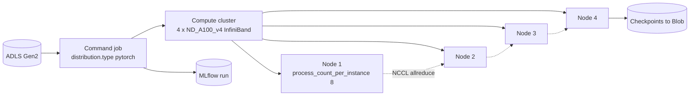
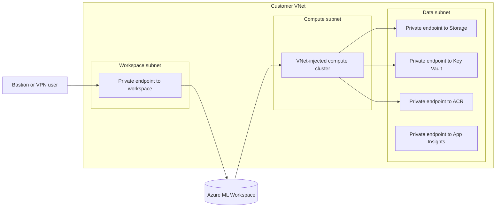
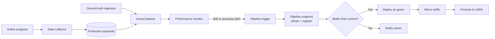
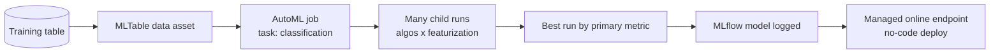

# Architectures - DP-100

> Reference architectures the exam asks about, plus annotated diagrams.

---

## 1. End-to-end MLOps with Azure ML

---

## 2. Real-time inference (online managed endpoint)

---

## 3. Batch scoring

---

## 4. Distributed GPU training

---

## 5. Private workspace (network-isolated)

> Set `public_network_access_enabled = false` on workspace; restrict storage to selected networks; ACR with private endpoint + dedicated SKU.

---

## 6. Closed-loop retraining

---

## 7. AutoML for tabular data

---

[<- Master Index](00-MASTER-INDEX.md)
